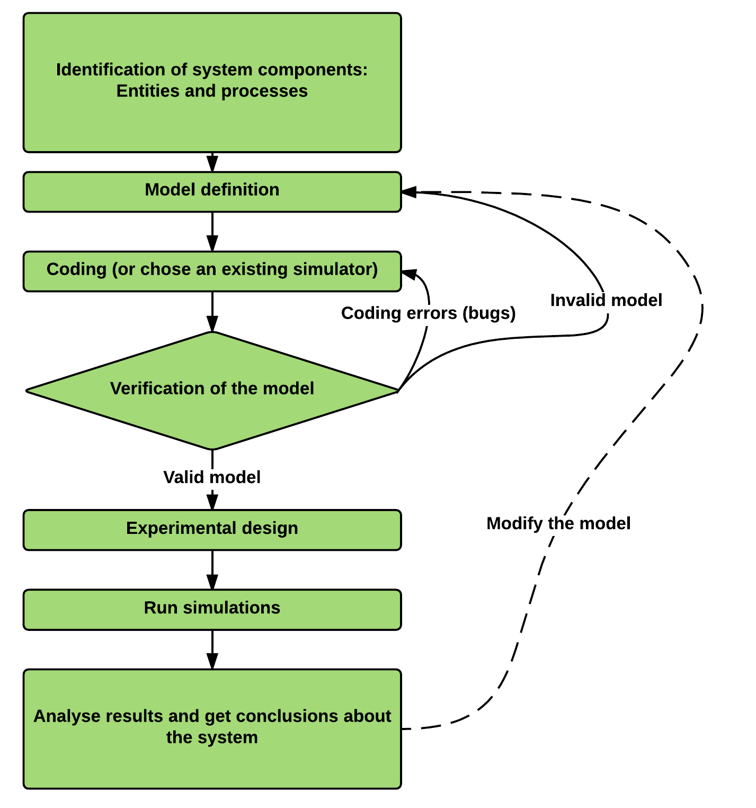
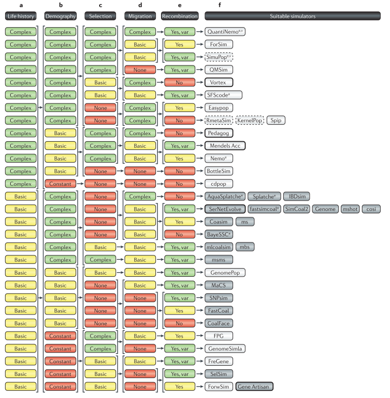

## An Overview of Individual-based Simulations in Population Genetics and Cancer
<br><br>
**Andrés Pérez-Figueroa** [(@anpefi)](http:anpefi.eu)
<br>
*Lab seminar*
<br>
22 April 2016
<br>
<br>


---

## GOALS
- Understand what is a simulation
---

## What is a (computer) simulation?

- An attempt to mimic a real-world empirical system
- The creation *in silico* of a possible world using computer programs to represent the processes under consideration
---

## Simulations as experimental systems

- Models could be as complex as the real systems they mimic
- A huge advantage: **models are strongly manipulable**
- Simulation models are properly explored using the same experimental and statistical techniques that are used to explore real-world systems

---

## genetic data simulation algorithms
- Backward-time (Coalescent)
- **Fordward-time**
- Resampling

---

## Building a simulation study



---
### An old example (from my Thesis)

```note
Made a figure with the chart in the 2010 book chapter
```
---

## Some simulators

---

## Computational modelling of Cancer

---

## Further readings

- Hoban S, Bertorelle G, Gaggiotti OE (2012) Computer simulations: tools for population and evolutionary genetics. [Nat Rev Genet 13:110–122.](http://dx.doi.org/10.1038/nrg3130)
- Peck SL (2004) Simulation as experiment: a philosophical reassessment for biological modeling. [Trends Ecol Evol 19:530–534.](http://www.ncbi.nlm.nih.gov/pubmed/16701318)
