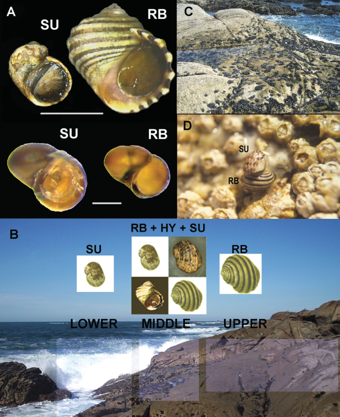
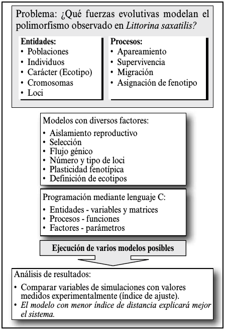
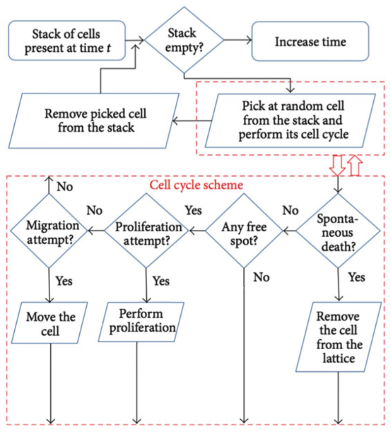
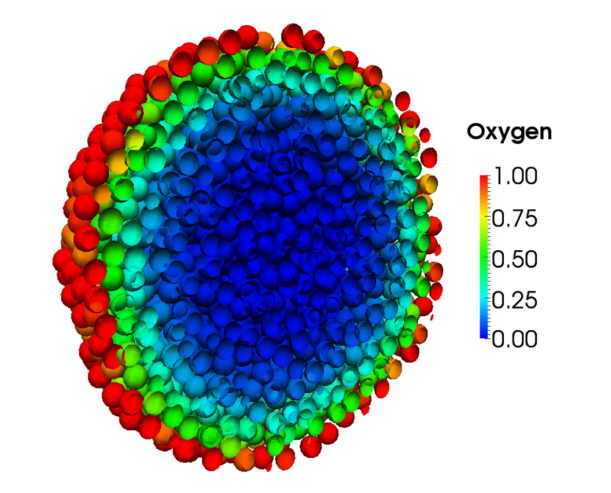
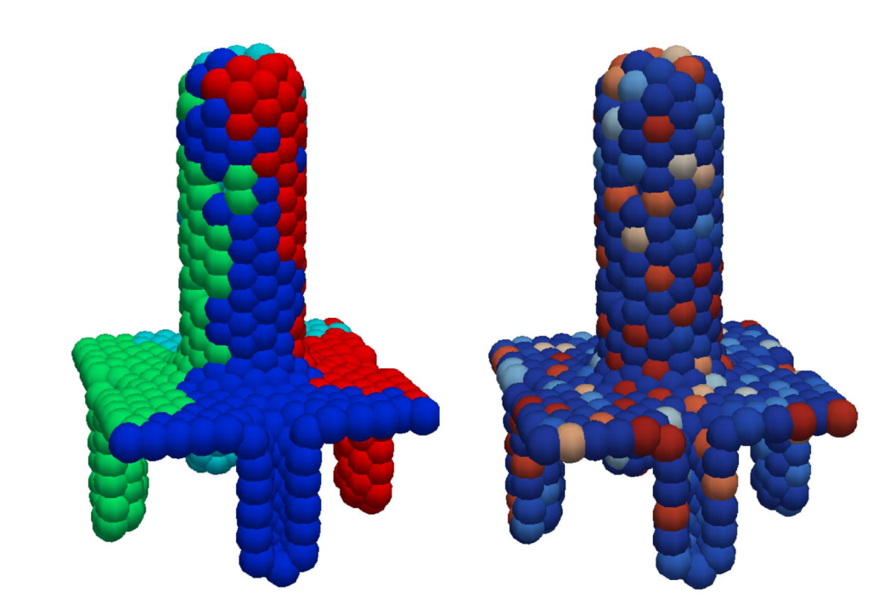
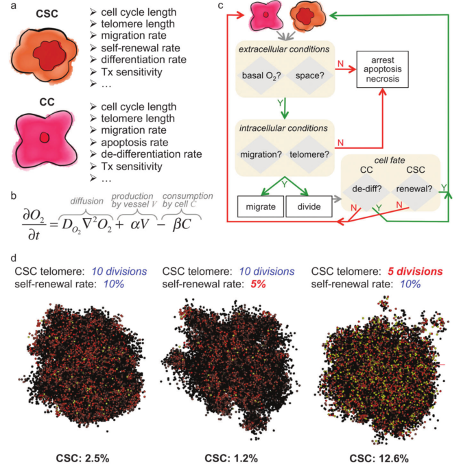
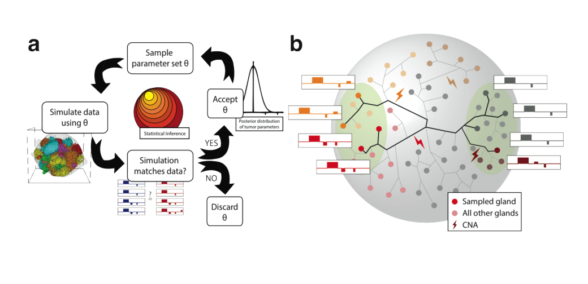
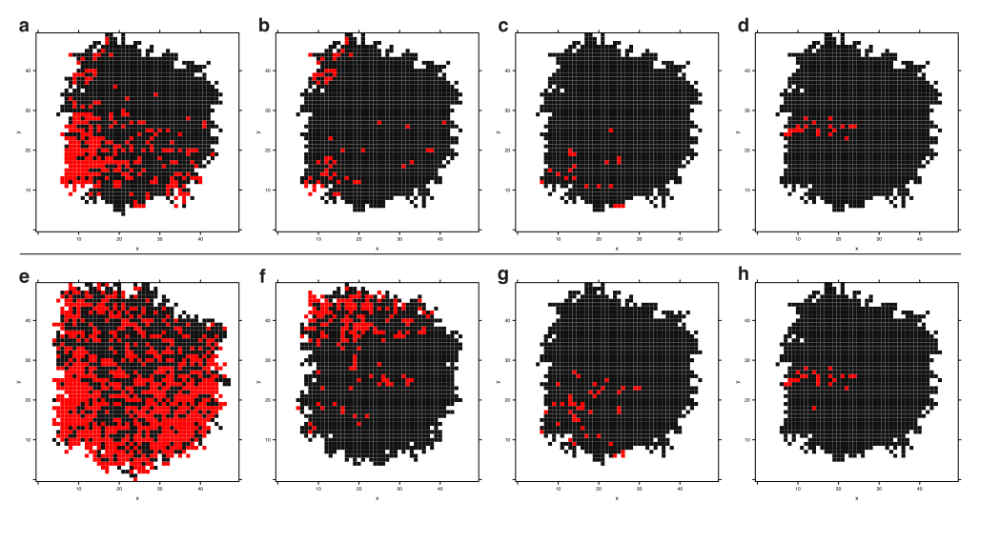
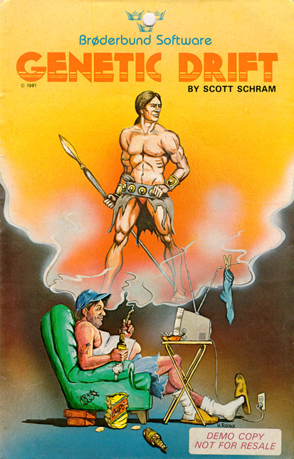

## An Overview of Individual-based Simulations in Population Genetics and Cancer
<br><br>
**Andrés Pérez-Figueroa** [(@anpefi)](http:anpefi.eu)
<br>
*Lab seminar*
<br>
22 April 2016
<br>
<br>


---

## GOALS
- Understand what is a simulation
- Learn how to build an Agent Based Model
- Explore how Agent Based Models had been used in cancer research
---

### What is a (computer) simulation?

- An attempt to mimic a real-world empirical system
- The creation *in silico* of a possible world using computer programs to represent the processes under consideration
---

### Simulations as experimental systems

- Models could be as complex as the real systems they mimic
- A huge advantage: **models are strongly manipulable**
- Simulation models are properly explored using the same experimental and statistical techniques that are used to explore real-world systems

---

### genetic data simulation algorithms
- Backward-time (Coalescent)
- **Fordward-time**
- Resampling
---

### Individual/Agent Based Models (IBMs/ABMs)
- Simulation models describing individual organisms (agents)
- How system level properties emerge from the adaptive behaviour of individuals and how the system affects individuals
- Aspects usually ignored in analytical models: individuals variability, local interactions, life cycles, ...
- More complex in structure than analytical models and then more difficult to analyze, understand and communicate

```note

```
---
### Structure of an ABM
1. A set of agents, their attributes and behaviours.
2. A set of agent relationships and methods of interaction:
An underlying topology of connectedness defines how
and with whom agents interact.
3. The agents’ environment: Agents interact with their
environment in addition to other agents.
<br>
<br>
<br>
Agents repeatedly and discretly execute their behaviours and interactions.

```note
To run an agent-based model is to have agents repeatedly execute their
behaviours and interactions. This process often does, but is not necessarily
modelled to, operate over a timeline, as in time-stepped, activity-based,
or discrete-event simulation structures.
```
---

### Building a simulation study


---

### Some Population Genetics simulators


---
### An old example (from my Thesis)


---
### ABMs in cancer research
- Tumor growth
- Phenotypes
- Dynamics of mutation accumulation
- Mostly deterministic laws (PDE)

---
#### examples ABM in cancer


---
#### examples ABM in cancer
  

---

### Enderling 2014 (CSC)


---
### Sottoriva 2015 (Big Bang in CRC)
- Agents: Glands (8M -> 80 billion cells)
- Growth by fission (variable rates), occurrence of CNAs and mutations
- All cells in a gland same fitness (survival and growth)
- Parameters: mutation rate and fitness change
- Not modeled: cellular migration, apoptosis within a gland, the contribution of the surrounding normal tissue or angiogenic factors.

```note

```
---
### Sottoriva 2015 (Big Bang in CRC)
- 400x400x400 lattice
- Starting from a single gland until 80M reached
- Sampling regions
- ABC to fit observed data
---
### Sottoriva 2015 (Big Bang in CRC)

---
### Sottoriva 2015 (Big Bang in CRC)
- Neutral clone

---
### Our interests
- Final goal is to do a general simulator of intratumoral pop gen.
- Start with a simple model, including selection and genealogy of all the alleles/clones
- Define and separate fitness traits (proliferation speed, growth speed, adhesion)
- Different set of genes/mutations for different traits (pleiotropy?)

---

### Limitations
- Huge computational cost of ABMs
- Limited number of agents or time units
- Reduced genome representation

---

### Further readings
Follow this link for a list of references for this talk: [http://bit.ly/1TmtseB](http://bit.ly/1TmtseB)

---
#### Thanks for coming

